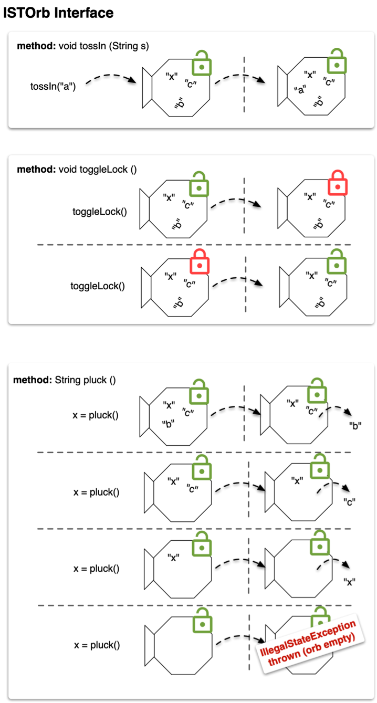

## IST Ord(inal)s 

In this assignment you'll develop a basic data abstraction termed 'the orb' 
that can be implemented in many ways using data structures that offer your 
orb-abstraction different performance.

### The core datatype

In this assignment you'll be implementing an **ISTOrb**. We can think about 
this entity abstractly as a widget that supports several basic functions 
illustrated below.

The interface should also offer methods:
* **boolean** isFullyEmptied()  
* **void** dumpOut() -- empties out the orb 

Note that `pluck` should always be removing in sorted order.

## Implementations

Note that by default, each of these implementations will hold String as 
data type stored in the ISTOrb.
 
* Supply an implementation of this interface called `Impl1` that uses a  
suitable linear collection type of your choosing to store the items tossed in. 
In this impl, ordering of the orb should occur when the `toggleLock` method is called.

* Now supply a linked implementation of this interface called `Impl2` that 
maintains a `frnt` and `end` pointer; calls to the interface methods will 
manipulate the chain to accomodate the addition or removal (via pluck) of an 
item. In this version, make the `pluck` method do a linear search and remove 
the minimum.

Be sure each implementation has a `toString` for rendering the structure. You'll
need this for testing purposes (see next section).

### Unit Testing

Provide unit tests for this structure. I won't prescribe a fixed number of
tests, though they should exercise the structure thoroughly. 

### Quality of Life Extensions (Choose One) 

* make the interface generic in some (comparable) type `T`; use Java's  
`Comparable` interface to achieve this; you can read up more on `Comparable` 
[here](https://www.geeksforgeeks.org/comparable-interface-in-java-with-examples/) 

* (little more complex -- but more general -- than the first option) make the interface
generic in some arbitrary type `T` (note that this one doesn't need to be bounded by `Comparable`);
the constructor for each implementation will need to accept a `Comparator<T>` as a parameter.

* make the interface extend Java's `Iterable` interface; this will allow
you to iterate of the contents of the structure using Java's enhanced for loops.
(Note: this will be more involved for `Impl2` due do the fact that it uses a
custom node pointer based implementation)
This link provides more background on
[Iterators](https://www.geeksforgeeks.org/java-implementing-iterator-and-iterable-interface/)
and their implementation.

### Reflection

Discuss these two implementations and give some explanation of how they are
working. Which one was easier and why? Discuss which implementation is better
in terms of the topics in the course we've been discussing recently
(e.g., implementation complexity, performance)? Are there any other possible 
implementations that use linear collection types that you can imagine?
(1 - 1.5 pgs).

# Handin

When you are ready to submit (or simply want to 'checkin' your work for the day),
open the terminal, cd to the project directory, make a commit by typing:

> git commit -am "message goes here"

then follow this up with a

> git push origin main
